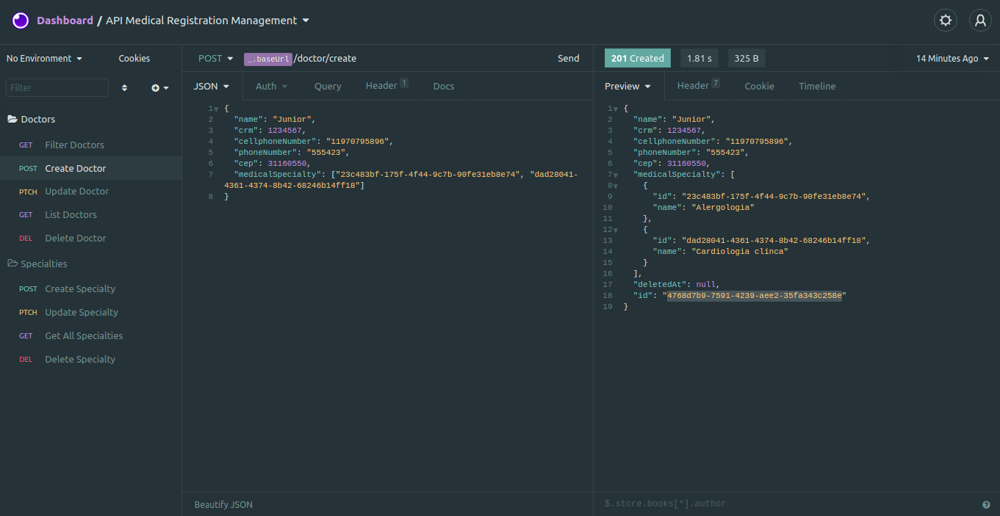

# Medical API

</br>

<p align="center">
  
</p>

## 🧾 About

**Medical API** is a CRUD API where you can manage doctors registration.

Please check the documentation:
https://www.notion.so/Medical-API-f6747e675c014a0f9b74e7a3e5cc4b39

</br>

---

</br>

## 🔧 Tools

- TypeORM
- NestJs
- PostgresSQL
- Nodejs
- ElephantSQL

</br>

---

</br>

## 👨‍💻 How to Setup

```bash
  # Clone the project
  $ git clone https://github.com/Levis44/API-Medical-Registration-Management.git
```

```bash
  # Enter directory and download dependecies
  $ cd api-medical-registration-management
  $ yarn
  $ code .
```

---

<p align="center">Done by Levi Bernardelli Ciarrocchi ✌🏼</p>
